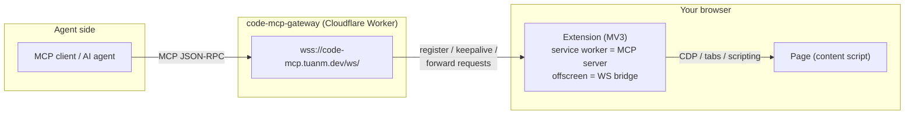

# Browser MCP

Expose your Chrome/Edge browser as MCP tools for any AI agent. A Chrome
extension (Manifest V3) acts as the MCP server itself: it connects to a
[code-mcp-gateway](https://github.com/Tuanm/code-mcp-gateway) and answers MCP
requests in place — no local server required. It speaks the same JSON-RPC
protocol as [code-mcp](https://github.com/Tuanm/code-mcp), so it drops into
existing agent setups.

## How it works



The popup takes a **Device ID** and **Token**; the extension connects straight
to the gateway (register, keepalive every 25s, 75s watchdog, jittered backoff
reconnect) and serves `initialize` / `tools/list` / `tools/call` in place.
Any agent that can reach the gateway can drive the browser.

An optional local server (`browser-mcp.ts`) adds a file store
(`file_read`, large downloads/uploads) and a plain local MCP HTTP endpoint.
See [Local server](#local-server).

## Quick start

Chrome or Edge >= 111. [Bun](https://bun.sh) >= 1.1 only needed for the local
server or dev tooling — the extension works standalone.

1. **Load the extension.** Open `chrome://extensions`, enable **Developer
   mode**, click **Load unpacked**, and select `packages/browser-extension`.
   (Or run `bun browser-mcp.ts` and download the zip from
   `http://127.0.0.1:7777/extension`.)
2. **Connect.** Click the toolbar icon (the MCP mark turns green when
   connected). Enter the gateway **Device ID** and **Token**, click **Connect**.
   The popup shows **Connected (gateway)**.
3. **Use it.** Point any MCP client at your gateway device. The extension
   answers `tools/list` with 47 tools.

> The token must match the one configured for this device on the gateway. The
> gateway forwards it with each request and the extension verifies it. Leave it
> empty and anyone reaching the gateway can control the browser.

## Local server

Only needed for the file store (`file_read`, downloads/uploads > 512 KB) or a
local MCP HTTP endpoint:

```bash
bun browser-mcp.ts                  # http://127.0.0.1:7777/mcp
bun browser-mcp.ts --token <s>      # require auth on /mcp + /files
```

With the server running, the popup also hands the ID + Token to the server's own
gateway link; without it the extension still works directly. Local clients use
`http://127.0.0.1:7777/mcp` — see `mcp-client.example.json` (add
`"headers": { "Authorization": "Bearer <token>" }` if you run with
`--token`). Verify: `curl -s http://127.0.0.1:7777/health`.

## Remote access via code-mcp-gateway

- **Direct (default).** Enter ID + Token in the popup; the extension serves MCP
  itself. No local server.
- **Server-side link.** With the local server, the popup connects to
  `wss://code-mcp.tuanm.dev/ws/<id>` and the server answers MCP over HTTP.
- **CLI (custom gateway):**

  ```bash
  bun browser-mcp.ts --gateway <domain> --token <s> --id <device-id>
  ```

  Same protocol as direct mode. Use the same `--token` on the gateway device;
  never run gateway mode without one. Set `BMCP_GATEWAY_DOMAIN` to override the
  popup's default gateway host.

## Tools (47)

Element discovery with the **@ref system**: `snapshot` returns an interactive
element tree with `[ref=eN]` markers; every interaction tool accepts the ref
or a CSS selector (refs are cached and resolved automatically; stale refs error
with "run snapshot again").

- **Discovery** — `snapshot`, `find` (role/name/text/label/placeholder/
  title/testid/selector), `get`, `is`
- **Interaction** — `click`, `dblclick`, `type`, `fill`, `check`,
  `uncheck`, `select`, `hover`, `focus`, `press`, `drag`,
  `scroll`, `upload`
- **Navigation** — `navigate`, `reload`, `back`, `forward`,
  `close`, `tabs`, `window`
- **Page reads** — `extract`, `execute`, `screenshot` (image block),
  `pdf`, `wait`, `highlight`
- **State & debugging** — `store`, `cookies`, `storage`,
  `console`, `errors`, `network`, `status`, `file_read`
- **Emulation & control** — `emulate`, `set` (viewport/device/geo/offline/
  headers/media), `perms`, `auth`, `dialog`, `frames`, `touch`,
  `download`

Console/errors/network capture starts on the first call (lazy), so reload or
navigate after enabling to capture traffic. Back/forward use CDP navigation
history. Run `curl -s -X POST http://127.0.0.1:7777/mcp -H
'Content-Type: application/json' -d '{"jsonrpc":"2.0","id":1,"method":"tools/list"}'`
for full schemas.

## Flags

| Flag | Description | Default |
| --- | --- | --- |
| `--port <n>` | Listen port | `7777` or `$PORT` |
| `--bind <addr>` | Bind address | `127.0.0.1` |
| `--token <s>` | Require auth on `/mcp` and `/files/*` | none |
| `--extension-token <s>` | Require this token from the extension on the bridge + file endpoints | none |
| `--gateway <domain>` | Link the MCP endpoint through a code-mcp-gateway | none |
| `--id <uuid>` | Gateway device id (overridden by the popup ID) | random |
| `--files-dir <path>` | Where downloaded/uploaded files are stored | `./files` |
| `--allow-any-origin` | DEV ONLY: skip the extension Origin check. Never on a shared machine | off |

## Security

- **Origin-gated.** `/browser/ws` accepts only `chrome-extension://` origins;
  `/mcp` and `/files/*` reject browser origins other than localhost — a
  malicious website can't drive your browser through localhost (CSRF). Native
  MCP clients (no Origin header) are unaffected.
- **`--token`** gates `/mcp` and `/files/*` (`?token=` or Bearer);
  `--extension-token` adds a secret the extension must present on the bridge.
- **File IDs** are 12-char random hex validated against a strict pattern;
  upload filenames are sanitized. Size caps: uploads 500 MiB, screenshots
  8 MiB inline.
- **`chrome.debugger`** shows the yellow infobar while attached (consent
  signal); `perms`/`cookies` use non-debugger APIs where possible.
- Binds to `127.0.0.1` by default; binding to `0.0.0.0` without `--token`
  prints a warning.

## Timeouts

Bridge commands: 30s default, 60s for navigate/execute/wait_for, 120s for
download/file_upload — capped at 120s locally and 55s in gateway mode (the
gateway aborts forwards after 60s). Tools accept `bridge_timeout` to override.

## Development

```bash
bun run check   # syntax-check server + scripts + extension JS
bun run test    # mock-extension + mock-gateway E2E suite
bun run build   # rebuild dist/browser-extension.zip
bun browser-mcp.ts  # run the server
```
