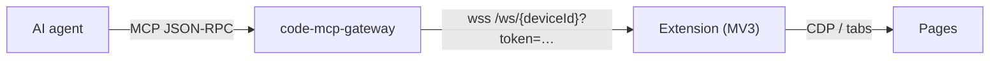

# Browser MCP

[](https://github.com/Tuanm/browser-mcp/actions/workflows/ci.yml)

**Chrome/Edge extension (Manifest V3) that turns the browser into an MCP server for AI agents — 67 browser tools, direct [code-mcp-gateway](https://github.com/Tuanm/code-mcp-gateway) mode, screen recording, TTS narration, page annotations.**

[](https://tuanm.github.io/browser-mcp)

## How it works



| Mode | Connection | When to use |
| --- | --- | --- |
| **Direct gateway** (default) | Popup: Device ID + Token → `wss://code-mcp.tuanm.workers.dev/ws/{id}` | Remote agents over the internet; extension serves MCP itself, no local server |
| **Local bridge** | `ws://localhost:7777/browser/ws` + `http://127.0.0.1:7777/mcp` | File store (`file_read`, large downloads/uploads) or a plain local HTTP endpoint |

Toolbar icon: **gray** = disconnected, **green** = connected.

## Install

Requires Chrome or Edge ≥ 111.

1. Open `chrome://extensions`, enable **Developer mode**, click **Load unpacked**, select `packages/browser-extension` (or install the zip above).
2. Click the toolbar icon, enter the gateway **Device ID** and **Token**, click **Connect** — the popup shows **Connected (gateway)**.

> The token must match the device's token configured on the [code-mcp-gateway](https://github.com/Tuanm/code-mcp-gateway). Leave it empty only if you accept that anyone reaching the gateway can control the browser.

## Tools (67)

Element discovery uses the **@ref system**: `snapshot` returns an interactive element tree with `[ref=eN]` markers; every interaction tool accepts a ref or a CSS selector.

| Group | Tools |
| --- | --- |
| Discovery | `snapshot`, `find`, `get`, `is`, `styles` |
| Interaction | `click`, `dblclick`, `type`, `fill`, `check`, `uncheck`, `select`, `hover`, `focus`, `press`, `drag`, `scroll`, `upload` |
| Navigation | `navigate`, `reload`, `back`, `forward`, `close`, `tabs`, `window`, `groups`, `history`, `bookmarks`, `session` |
| Page reads | `extract`, `execute`, `screenshot` (image block), `pdf`, `wait`, `highlight` |
| Network & DevTools | `network`, `intercept`, `har`, `ws`, `throttle`, `resources`, `coverage`, `pseudo`, `site_data`, `notify` |
| State & debugging | `store`, `cookies`, `storage`, `console`, `errors`, `status`, `file_read`, `extension` |
| Emulation & control | `emulate`, `set`, `perms`, `auth`, `dialog`, `frames`, `touch`, `download`, `record` |
| Media & narration | `speak`, `transcript`, `paint` |
| Vault | `vault` |

### Media & narration

| Tool | Behavior |
| --- | --- |
| `speak` | Narrates each step via native speech synthesis (`say`/`voices`/`stop`/`status`; English-first). During session recording the voice is additionally routed into the WebM where the browser allows — `speechSynthesis` itself plays to the system speakers and cannot be captured by MediaRecorder |
| `transcript` | Caption bar for narrated text (`show` with `duration_ms`/`position`, `clear`, `status`) — always captured in recordings/screenshots even when the TTS voice cannot be routed into the audio track |
| `paint` | Draws arrows, boxes, circles, highlights and text labels on a fixed overlay (`draw`/`clear`/`status`) that is part of the page pixels, so annotations appear in recordings and screenshots |

### Vault

Encrypted in-browser credential store: master password → PBKDF2 → AES-256-GCM, stored in `chrome.storage.local`, never sent to the gateway.

| Action | Purpose |
| --- | --- |
| `init`, `unlock`, `lock`, `status` | Vault lifecycle |
| `set`, `get`, `list`, `delete` | Credential CRUD |
| `fill` | Fill a login form from the vault — secrets never leave the extension |
| `auth` (`vault_name`) | Supply HTTP Basic/Digest credentials from the unlocked vault instead of tool arguments |

## Local server

```bash
bun browser-mcp.ts                  # http://127.0.0.1:7777/mcp
bun browser-mcp.ts --token <s>      # require auth on /mcp + /files
```

Local clients use `http://127.0.0.1:7777/mcp` — see `mcp-client.example.json`. Verify: `curl -s http://127.0.0.1:7777/health`.

## CLI

```bash
bun browser-mcp.ts --gateway <domain> --token <s> --id <device-id>
```

| Flag | Description | Default |
| --- | --- | --- |
| `--port <n>` | Listen port | `7777` or `$PORT` |
| `--bind <addr>` | Bind address | `127.0.0.1` |
| `--token <s>` | Require auth on `/mcp` and `/files/*` | none |
| `--extension-token <s>` | Require this token from the extension | none |
| `--gateway <domain>` | Link the MCP endpoint through a code-mcp-gateway | none |
| `--id <uuid>` | Gateway device id (overridden by the popup ID) | random |
| `--files-dir <path>` | Where downloaded/uploaded files are stored | `./files` |
| `--allow-any-origin` | DEV ONLY: skip the extension Origin check | off |

## Security

- `/browser/ws` accepts only `chrome-extension://` origins; `/mcp` and `/files/*` reject browser origins other than localhost (CSRF).
- `--token` gates `/mcp` and `/files/*` (`?token=` or Bearer); `--extension-token` gates the extension bridge.
- In gateway mode the extension verifies the device token forwarded with each request before answering.
- File IDs are 12-char random hex, validated and sanitized; uploads capped at 500 MiB, screenshots 8 MiB inline.
- Binds to `127.0.0.1` by default; binding to `0.0.0.0` without `--token` prints a warning.

## Development

```bash
bun run check   # syntax check
bun run test    # test suite
bun run build   # build dist/browser-extension.zip
bun browser-mcp.ts  # run the server
```
