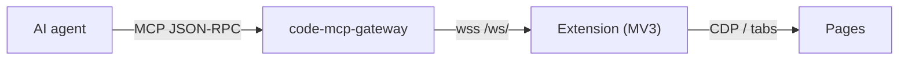

# Browser MCP

[](https://github.com/Tuanm/browser-mcp/actions/workflows/ci.yml)

A Chrome/Edge extension that turns the browser into an MCP server. It connects
directly to a [code-mcp-gateway](https://github.com/Tuanm/code-mcp-gateway)
(`wss://code-mcp.tuanm.dev/ws/<id>`) and answers MCP requests in place — no
local server required.



Latest build: [browser-mcp-extension.zip](https://tuanm.github.io/browser-mcp/browser-mcp-extension.zip)

## Install

Requires Chrome or Edge >= 111.

1. Open `chrome://extensions`, enable **Developer mode**, click **Load
   unpacked**, select `packages/browser-extension`. (Or download the zip
   above.)
2. Click the toolbar icon, enter the gateway **Device ID** and **Token**, click
   **Connect**. The popup shows **Connected (gateway)**.

> The token must match the one configured for the device on the gateway. Leave
> it empty and anyone reaching the gateway can control the browser.

## Tools (63)

Element discovery uses the **@ref system**: `snapshot` returns an interactive
element tree with `[ref=eN]` markers; every interaction tool accepts a ref or
a CSS selector.

- **Discovery** — `snapshot`, `find`, `get`, `is`, `styles`
- **Interaction** — `click`, `dblclick`, `type`, `fill`, `check`,
  `uncheck`, `select`, `hover`, `focus`, `press`, `drag`,
  `scroll`, `upload`
- **Navigation** — `navigate`, `reload`, `back`, `forward`,
  `close`, `tabs`, `window`, `groups`, `history`, `bookmarks`,
  `session`
- **Page reads** — `extract`, `execute`, `screenshot` (image block),
  `pdf`, `wait`, `highlight`
- **Network & DevTools** — `network`, `intercept`, `har`, `ws`,
  `throttle`, `resources`, `coverage`, `pseudo`, `site_data`,
  `notify`
- **State & debugging** — `store`, `cookies`, `storage`,
  `console`, `errors`, `status`, `file_read`, `extension`
- **Emulation & control** — `emulate`, `set`, `perms`, `auth`,
  `dialog`, `frames`, `touch`, `download`
- **Vault** — `vault`: encrypted in-browser credential store (master
  password → PBKDF2 → AES-256-GCM, stored in `chrome.storage.local`, never
  sent to the gateway). Actions: `init`, `unlock`, `lock`, `status`, `set`,
  `get`, `list`, `delete`

## Local server

Optional. Needed for the file store (`file_read`, downloads/uploads > 512 KB)
or a local MCP HTTP endpoint:

```bash
bun browser-mcp.ts                  # http://127.0.0.1:7777/mcp
bun browser-mcp.ts --token <s>      # require auth on /mcp + /files
```

Local clients use `http://127.0.0.1:7777/mcp` — see `mcp-client.example.json`.
Verify: `curl -s http://127.0.0.1:7777/health`.

## CLI

```bash
bun browser-mcp.ts --gateway <domain> --token <s> --id <device-id>
```

| Flag | Description | Default |
| --- | --- | --- |
| `--port <n>` | Listen port | `7777` or `$PORT` |
| `--bind <addr>` | Bind address | `127.0.0.1` |
| `--token <s>` | Require auth on `/mcp` and `/files/*` | none |
| `--extension-token <s>` | Require this token from the extension | none |
| `--gateway <domain>` | Link the MCP endpoint through a code-mcp-gateway | none |
| `--id <uuid>` | Gateway device id (overridden by the popup ID) | random |
| `--files-dir <path>` | Where downloaded/uploaded files are stored | `./files` |
| `--allow-any-origin` | DEV ONLY: skip the extension Origin check | off |

## Security

- `/browser/ws` accepts only `chrome-extension://` origins; `/mcp` and
  `/files/*` reject browser origins other than localhost (CSRF).
- `--token` gates `/mcp` and `/files/*` (`?token=` or Bearer);
  `--extension-token` gates the extension bridge.
- File IDs are 12-char random hex, validated and sanitized; uploads capped at
  500 MiB, screenshots 8 MiB inline.
- Binds to `127.0.0.1` by default; binding to `0.0.0.0` without `--token`
  prints a warning.

## Development

```bash
bun run check   # syntax check
bun run test    # test suite
bun run build   # build dist/browser-extension.zip
bun browser-mcp.ts  # run the server
```
