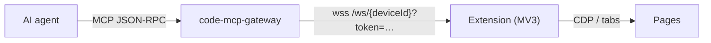

# Browser MCP

[](https://github.com/Tuanm/browser-mcp/actions/workflows/ci.yml)

**Chrome/Edge extension (Manifest V3) that turns the browser into an MCP server for AI agents — 68 browser tools, direct [code-mcp-gateway](https://github.com/Tuanm/code-mcp-gateway) mode, screen recording, TTS narration, page annotations.**

[](https://tuanm.github.io/browser-mcp)

## How it works


```mermaid
flowchart LR
    A["AI agent"] -->|"MCP JSON-RPC"| G["code-mcp-gateway"]
    G -->|"wss /ws/{deviceId}?token=…"| E["Extension (MV3)"]
    E -->|"CDP / tabs"| P["Pages"]
```

| Mode | Connection | When to use |
| --- | --- | --- |
| **Direct gateway** (default) | Popup: Device ID + Token → `wss://code-mcp.tuanm.workers.dev/ws/{id}` | Remote agents over the internet; extension serves MCP itself, no local server |
| **Local bridge** | `ws://localhost:7777/browser/ws` + `http://127.0.0.1:7777/mcp` | File store (`file_read`, large downloads/uploads) or a plain local HTTP endpoint |

Toolbar icon: **gray** = disconnected, **green** = connected.

## Install

Requires Chrome or Edge ≥ 111.

1. Open `chrome://extensions`, enable **Developer mode**, click **Load unpacked**, select `packages/browser-extension` (or install the zip above).
2. Click the toolbar icon, enter the gateway **Device ID** and **Token**, click **Connect** — the popup shows **Connected (gateway)**.

> The token must match the device's token configured on the [code-mcp-gateway](https://github.com/Tuanm/code-mcp-gateway). Leave it empty only if you accept that anyone reaching the gateway can control the browser.

### Browser support

| Browser | Gateway tunnel | Notes |
| --- | --- | --- |
| Chrome / Edge ≥ 111 | offscreen document | Full feature set (CDP tools, recordings, OS-dialog guard) |
| Safari, **Orion on iOS/iPadOS** (WebKit) | **service-worker bridge** (automatic fallback) | No `chrome.offscreen` **and no `chrome.debugger`**, so the extension hosts the tunnel in the service worker and drives the page with `chrome.scripting` instead of CDP. Most tools work; see below |

On WebKit the extension automates what CDP would otherwise provide:

- **Tools that never needed CDP** keep working unchanged: `snapshot`, `find`, `get`, `is`, `fill`, `focus`, `dblclick`, `navigate`, `tabs`, `cookies`, `storage`, `store`, `highlight`, `speak`, `transcript`, `notify`, `bookmarks`, `reload`, `back`, `forward`, `close`, and more.
- **Routed to scripting implementations**: `click`, `type`, `keypress`, `scroll`, `hover`, `execute`, `screenshot` (viewport), `extract`, plus `check`/`uncheck`, `styles` (computed values), `frames`, `file_upload` (inline base64 content), `drag`.
- **Injected page instrumentation** replaces the Runtime/Page CDP domains: `console`, `errors`, and `dialog`. Because a JS dialog cannot be paused without CDP, `alert`/`confirm`/`prompt` are answered with a **safe default** (alert dismissed, `confirm` → `false`, `prompt` → `null`) and recorded for `dialog action=status`; choose the answers up front with `dialog {action:"auto", confirm:true}`.

**Not available on WebKit** (no workaround exists): passkey/WebAuthn virtual authenticator (so no OS passkey-dialog prevention), network internals (`network`, `intercept`, `har`, `ws`, `throttle`), device emulation, HTTP-auth credential injection, `tabCapture`/screencast recording, and true full-page screenshots.

The capabilities actually available are reported by `extension {action:"state"}` (`bridge`, `capabilities.offscreen`, `capabilities.debugger`, `capabilities.tab_capture`), and the popup says exactly which API is missing instead of a generic "check your Device ID/Token".

## Tools (68)

Element discovery uses the **@ref system**: `snapshot` returns an interactive element tree with `[ref=eN]` markers; every interaction tool accepts a ref or a CSS selector.

| Group | Tools |
| --- | --- |
| Discovery | `snapshot`, `find`, `get`, `is`, `styles` |
| Interaction | `click`, `dblclick`, `type`, `fill`, `check`, `uncheck`, `select`, `hover`, `focus`, `press`, `drag`, `scroll`, `upload` |
| Navigation | `navigate`, `reload`, `back`, `forward`, `close`, `tabs`, `window`, `groups`, `history`, `bookmarks`, `session` |
| Page reads | `extract`, `execute`, `screenshot` (image block), `pdf`, `wait`, `highlight` |
| Network & DevTools | `network`, `intercept`, `har`, `ws`, `throttle`, `resources`, `coverage`, `pseudo`, `site_data`, `notify` |
| State & debugging | `store`, `cookies`, `storage`, `console`, `errors`, `status`, `file_read`, `extension` |
| Emulation & control | `emulate`, `set`, `perms`, `auth`, `webauthn`, `dialog`, `frames`, `touch`, `download`, `record` |
| Media & narration | `speak`, `transcript`, `paint` |
| Vault | `vault` |

### Media & narration

| Tool | Behavior |
| --- | --- |
| `speak` | Narrates each step via native speech synthesis (`say`/`voices`/`stop`/`status`; English-first). During session recording the voice is additionally routed into the WebM where the browser allows — `speechSynthesis` itself plays to the system speakers and cannot be captured by MediaRecorder |
| `transcript` | Caption bar for narrated text (`show` with `duration_ms`/`position`, `clear`, `status`) — always captured in recordings/screenshots even when the TTS voice cannot be routed into the audio track |
| `paint` | Draws arrows, boxes, circles, highlights and text labels on a fixed overlay (`draw`/`clear`/`status`) that is part of the page pixels, so annotations appear in recordings and screenshots |

### Vault

Encrypted in-browser credential store: master password → PBKDF2 → AES-256-GCM, stored in `chrome.storage.local`, never sent to the gateway.

| Action | Purpose |
| --- | --- |
| `init`, `unlock`, `lock`, `status` | Vault lifecycle |
| `set`, `get`, `list`, `delete` | Credential CRUD |
| `fill` | Fill a login form from the vault — secrets never leave the extension |
| `auth` (`vault_name`) | Supply HTTP Basic/Digest credentials from the unlocked vault instead of tool arguments |

### Gateway file storage

`download` and `upload` can use the device's temporary file storage on code-mcp-gateway (`/files`) instead of this machine's disk:

```jsonc
// 1. after a click starts a download in the agent's tab
{ "name": "download", "arguments": { "action": "wait", "destination": "gateway" } }
// -> { "saved_to": "gateway", "file": { "id": "3f2a…", "name": "report.pdf", "protected": true, … }, "removed_from_device": true }

// 2. later, into another site's <input type=file>
{ "name": "upload", "arguments": { "selector": "#attachment", "source": "gateway", "file_id": "3f2a…" } }
```

| Argument | Tool | Meaning |
| --- | --- | --- |
| `destination: "device" \| "gateway"` | `download` (`wait`, `latest`) | Where the finished download ends up. Default `device` (unchanged behaviour) |
| `expiry_days` | `download` | Gateway lifetime, max 7 (the default) |
| `source: "device" \| "gateway"` | `upload` | Where the file comes from. With `gateway`, pass `file_id` instead of `content` |

What keeps this from moving data it shouldn't:

- **Only the agent's own downloads leave the device.** A download is sent only if the DevTools Protocol saw it begin in the agent's tab (`tab_id`, default the active tab). That event is scoped to the tab's session — verified in Chromium: a download in another tab is never reported to it — so a file the user downloads elsewhere is refused and stays put. Stealth-mode downloads are not tracked and cannot be sent.
- **Stored privately.** Each file is protected at creation (`X-File-Key`, a random 256-bit key that is never returned or logged), so only this device's credentials can read it until a person chooses to share it from `/files`.
- **Credentials stay in the extension.** The gateway origin comes from the popup configuration, never from a tool argument; device credentials go in an `Authorization` header from extension contexts only — never in a URL, a tool result, or the page.
- **Only this device's files go up.** `file_id` must be a 32-hex id from the device's own listing; another device's file is refused before its bytes are fetched.
- **Never in the clear.** The gateway is reached over HTTPS (plain HTTP only for localhost/LAN, as for the bridge), and a gateway file is uploaded only into an `https://` page (or a local `http://` one).
- **Nothing is lost on failure.** The local copy is removed only after the gateway confirms the file (`201`); otherwise it stays on the device. Signed-URL query strings are stripped from the reported `source`.
- **Nothing in a tab can drive it.** Web pages cannot message the extension at all; as defence in depth, the offscreen document's file handlers also refuse the extension's own content scripts (which run inside pages), and will only ever post to a gateway `/api/files` endpoint.

Limits: 200 MiB per stored file (and the gateway's per-device quotas), 25 MiB per page upload. The browser still writes a download to disk before it is sent; "instead of the device" means it is removed once stored.

`bun scripts/test-gateway-files.ts` checks all of the above through the real extension code; `bun run test:gateway` repeats it against a real code-mcp-gateway worker from a sibling checkout.

### OS-dialog prevention (automatic)

While the extension is **connected** and an agent is driving a tab, native prompts that no extension can read or click are suppressed automatically — **the agent never has to call a tool for this**:

| Suppressed | How |
| --- | --- |
| WebAuthn / passkey dialog (Windows Hello, security key, Okta/WAM) | A CDP virtual authenticator is armed **before** every agent click/navigation and survives the redirect, so a click that bounces into an Okta/Entra page which fires WebAuthn on load is answered inside the renderer. Chrome's normal WebAuthn UI stays enabled, so a ceremony the virtual authenticator *cannot* satisfy still behaves exactly as it does without the extension |
| Download Keep/Discard bubble + downloads shelf | `Browser.setDownloadBehavior` + downloads UI hidden whenever the debugger attaches |

The guard arms on connect (active tab), before page-interaction commands (`navigate`, `click`, `type`, `fill`, `keypress`, `select`, `drag`, `execute`, … — never on read-only calls like `tabs` or `bookmarks`), and on tabs the agent opens while it is driving. It is skipped under `stealth`. Turn it off with `webauthn {action:"auto", enabled:false}`.

> **HTTP Basic/Digest is opt-in.** Chromium rejects `handleAuthRequests` with an empty pattern list and only emits `authRequired` for pattern-matched requests, so intercepting it would pause every matching request on every agent-driven tab. Call the `auth` tool when a site needs it instead.

`webauthn` also exposes explicit control when the agent wants it:

| Action | Purpose |
| --- | --- |
| `enable`, `disable`, `status` | Install / remove / inspect the virtual authenticator for a tab |
| `auto` | Toggle the automatic guard above |
| `add`, `list`, `remove`, `clear` | Manage credentials (resident passkeys). `add` generates an ES256 key in-browser when `private_key` is omitted |

An OS dialog that is *already* on screen cannot be read or clicked by any extension. A `get()` that needs a credential held only by the platform authenticator (your real Windows Hello passkey) still reaches the OS — enroll a passkey into the virtual authenticator, or preload its key with `add`.

## Local server

```bash
bun browser-mcp.ts                  # http://127.0.0.1:7777/mcp
bun browser-mcp.ts --token <s>      # require auth on /mcp + /files
```

Local clients use `http://127.0.0.1:7777/mcp` — see `mcp-client.example.json`. Verify: `curl -s http://127.0.0.1:7777/health`.

## CLI

```bash
bun browser-mcp.ts --gateway <domain> --token <s> --id <device-id>
```

| Flag | Description | Default |
| --- | --- | --- |
| `--port <n>` | Listen port | `7777` or `$PORT` |
| `--bind <addr>` | Bind address | `127.0.0.1` |
| `--token <s>` | Require auth on `/mcp` and `/files/*` | none |
| `--extension-token <s>` | Require this token from the extension | none |
| `--gateway <domain>` | Link the MCP endpoint through a code-mcp-gateway | none |
| `--id <uuid>` | Gateway device id (overridden by the popup ID) | random |
| `--files-dir <path>` | Where downloaded/uploaded files are stored | `./files` |
| `--allow-any-origin` | DEV ONLY: skip the extension Origin check | off |

## Security

- `/browser/ws` accepts only `chrome-extension://` origins; `/mcp` and `/files/*` reject browser origins other than localhost (CSRF).
- `--token` gates `/mcp` and `/files/*` (`?token=` or Bearer); `--extension-token` gates the extension bridge.
- In gateway mode the extension verifies the device token forwarded with each request before answering.
- File IDs are 12-char random hex, validated and sanitized; uploads capped at 500 MiB, screenshots 8 MiB inline.
- Gateway file storage (`destination`/`source: "gateway"`): agent-tab downloads only, stored privately, credentials never in URLs or results, own files only, HTTPS-only pages — see [Gateway file storage](#gateway-file-storage).
- Binds to `127.0.0.1` by default; binding to `0.0.0.0` without `--token` prints a warning.

## Development

```bash
bun run check   # syntax check
bun run test    # test suite
bun run build   # build dist/browser-extension.zip
bun browser-mcp.ts  # run the server
```
