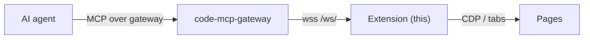

# Browser MCP Extension

Chrome/Edge extension (Manifest V3) that turns the browser into an MCP server
for AI agents.

Two modes:

- **Direct (default).** Enter a **Device ID** (+ optional **Token**) in the
  popup; the extension connects to the code-mcp gateway
  (`wss://code-mcp.tuanm.dev/ws/<id>`) and serves MCP itself. No local server.
- **Local bridge.** With `browser-mcp.ts` running, the extension connects over
  `ws://localhost:7777/browser/ws` and the server answers MCP over HTTP
  (`http://127.0.0.1:7777/mcp`). Use this for the file store
  (`file_read`, large downloads/uploads) or a plain local HTTP endpoint.

The toolbar icon shows the MCP mark — **gray** disconnected, **green**
connected.

## Install

1. Open `chrome://extensions`, enable **Developer mode**, click **Load
   unpacked**, select this directory. (Or run `bun browser-mcp.ts` and download
   the zip from `http://127.0.0.1:7777/extension`.)
2. Click the toolbar icon; enter the gateway **Device ID** and **Token**, click
   **Connect**. The popup shows **Connected (gateway)** once the gateway accepts
   the registration.

## Tools

47 MCP tools, including:

- **Discovery** — `snapshot` (interactive tree with `[ref=eN]` markers),
  `find`, `get`, `is`
- **Interaction** — `click`, `type`, `fill`, `hover`, `drag`,
  `select`, `check`, `press`, `upload`, and more — each accepts a ref
  from `snapshot` or a CSS selector
- **Navigation** — `navigate`, `tabs`, `window`, `reload`, `back`,
  `forward`
- **Page reads** — `extract`, `execute`, `screenshot` (image block),
  `pdf`, `wait`
- **State** — `store`, `cookies`, `storage`, `console`, `errors`,
  `network`, `status`
- **Emulation** — `emulate`, `set` (viewport/device/geo/offline/headers),
  `perms`, `auth`, `frames`, `touch`, `download`

## Security

- In direct mode the gateway forwards the device **Token** with each request and
  the extension verifies it before answering. Leave it empty only if you accept
  that anyone reaching the gateway can control the browser.
- `chrome.debugger` shows the yellow infobar as a consent signal.
- All commands run inside your browser profile; nothing is stored remotely.
